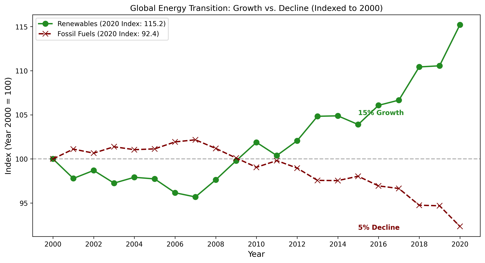

# Global Energy Transition Analysis: Growth vs. Decline (2000–2020)  
Data Source: Compiled dataset hosted on [Kaggle](www.kaggle.com/datasets/anshtanwar/global-data-on-sustainable-energy), aggregating global metrics from the World Bank, the International Energy Agency (IEA) and Our World in Data (SDG 7).  

### By Nurul Athirah  

## Executive Summary  

Problem: The global energy landscape is changing, but looking at raw percentages makes the growth of green energy look deceptively small and slow. This happens because fossil fuels dominate the total volume.  
Goal: To look past the sheer size of these energy sources and accurately measure and analyze relative growth rate of renewable energy deployment against fossil fuel dependency globally from 2000 to 2020.

## Data Cleaning & Transformation Pipeline  

Here is how the data was transformed from a messy raw file into a high-quality analysis:  

1. Column Type Conversion: The `Density\\n(P/Km2)` column was showing up as an `object` (text) because of formatting issues. Cleaned the string characters and forced the column type to a float/numeric data type using Pandas.
2. Null Values (Missing Data): Investigated the null values and dropped the columns that are **missing more than 25% of its data** as they can threatened the completeness of the project and introduce massive bias.
3. Duplicate Rows: Ran a global duplicate verification check across key tracking columns and confirmed the dataset was **100% unique**. It is to ensures that every country has exactly one record per year, protecting the integrity of all calculations.

### The Calculation Pipeline:  

1. Get Percentage Share:   Combined the total of two column (Electricity from renewables (TWh) & Electricity from fossil fuels (TWh)) to find Total Generation, then calculated each source's percentage out of this total.
2. Find Global Average: Used Pandas `.groupby('Year').mean()` to calculate the average of the countries' percentages for each respective year. This condenses thousands of country rows into a single global timeline.
3. Index Baseline (Year 2000 = 100): Used `.iloc[0]` to extract the very first row of this chronological timeline which is the global average for the year 2000 and used it as a locked mathematical divisor. Every subsequent year's average was divided by this year 2000 baseline value, then multiplied by 100. Because the year 2000 divides by itself, it naturally quantified at exactly 100.

## Data Insights  

  

1. Steady transition: Both lines move in gradual, steady slopes rather than sudden spikes.   Because energy relies on massive physical power grids and factories, change takes time. By using discrete chart markers (`o` and `x`) for every single year, the chart clearly maps this steady, year-by-year shift rather than a sudden disruption.  
2. Turning point: 2012 was the official "pivot" year for the global energy mix. Before 2012, fossil fuels held perfectly steady. After 2012, renewables accelerated upward, and fossil fuels began their permanent decline. Adding a clear baseline line at 100 (`plt.axhline`) gives an immediate visual threshold and instantly show the exact year where green energy started actively **replacing** fossil fuels.
3. Growth rate: By 2020, Renewables climbed to an index of **115 (a 15% growth)**, while Fossil Fuels dropped to **95 (a 5% decline)**.   In the raw data, a 5% drop in fossil fuels looks tiny. But by normalizing the data to a baseline of 100, it is shown that **Renewables are scaling up three times faster than fossil fuels are backing down.** Green energy is successfully capturing the vast majority of new global power demands.
